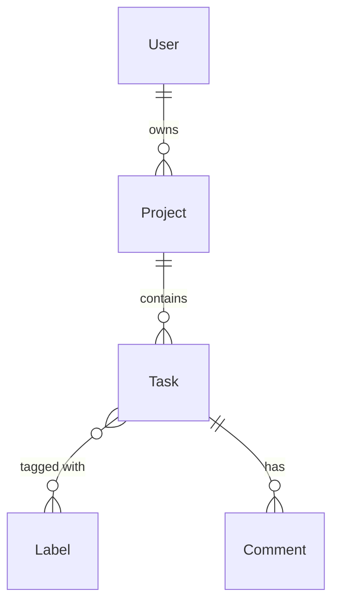

# DB Schema — `/dev db-schema <feature>`

> **Agent:** Andre (Backend Dev) | **Framework:** Relational Schema Design + Laravel Conventions

## Schema Design Process

1. **Requirements -> Entities** -- extract nouns as candidate tables
2. **Identify Relationships** -- 1:1, 1:N, M:N (junction tables)
3. **Add Cross-cutting Concerns** -- see table below
4. **Normalize** -- at least 3NF, denormalize only with measured need
5. **Index Strategy** -- foreign keys, frequent WHERE/ORDER columns
6. **Generate Migration** -- framework-specific migration code
7. **Generate ERD** -- Mermaid diagram from schema

## Cross-cutting Concerns

| Concern | Implementation | When |
|---------|---------------|------|
| **Timestamps** | `created_at`, `updated_at` | Every table (NON-NEGOTIABLE) |
| **Soft deletes** | `deleted_at TIMESTAMPTZ` | Auditable data (orders, users) |
| **Multi-tenancy** | `organization_id` FK on all tenant-scoped tables | SaaS applications |
| **Audit trail** | `created_by`, `updated_by` + audit log table | Regulated domains |
| **Optimistic locking** | `version INTEGER` column | Concurrent update scenarios |
| **Public IDs** | UUID/CUID for URLs/APIs, auto-increment internal | Public-facing resources |

## Index Strategy

| Index Type | When to Use | Example |
|-----------|------------|---------|
| **Single column** | FK columns, frequent WHERE | `INDEX idx_tasks_project_id ON tasks(project_id)` |
| **Composite** | Multi-column WHERE clauses | `INDEX idx_tasks_org_status ON tasks(org_id, status)` |
| **Partial** | Filtered queries on subset | `WHERE deleted_at IS NULL` |
| **Covering** | Avoid table lookups | Include all SELECT columns in index |
| **Unique** | Business key enforcement | `UNIQUE(org_id, slug)` |

## Normalization Quick Reference

| Form | Rule | Violation Example |
|------|------|------------------|
| **1NF** | Atomic values, no repeating groups | `tags: "a,b,c"` in one column |
| **2NF** | No partial dependency on composite PK | Non-key depends on part of PK |
| **3NF** | No transitive dependency | `city` depends on `zip`, not PK |

Denormalize only when: measured query performance requires it AND read/write ratio justifies it.

## Common Pitfalls

| Pitfall | Fix |
|---------|-----|
| Soft delete without partial index | Add `WHERE deleted_at IS NULL` index |
| Missing composite indexes | Profile queries, add composite for multi-column WHERE |
| Mutable surrogate keys (email as PK) | Use UUID/CUID, keep email as unique constraint |
| NOT NULL column without default on existing table | Provide default or multi-step migration |
| No optimistic locking | Add `version` column for concurrent writes |
| RLS not tested | Always test with non-superuser role |

## Laravel Migration Convention

```php
Schema::create('tasks', function (Blueprint $table) {
    $table->id();
    $table->uuid('uuid')->unique();
    $table->foreignId('project_id')->constrained()->cascadeOnDelete();
    $table->foreignId('created_by_id')->constrained('users');
    $table->string('title');
    $table->text('description')->nullable();
    $table->string('status')->default('todo');
    $table->string('priority')->default('medium');
    $table->integer('position')->default(0);
    $table->integer('version')->default(1);
    $table->timestamps();
    $table->softDeletes();

    $table->index(['project_id', 'status']);
    $table->index(['created_by_id']);
});
```

## ERD Output (Mermaid)



## Proactive Triggers

Surface these issues WITHOUT being asked:

- Table with >20 columns → suggest normalization
- Missing index on foreign key → flag query performance
- No soft delete on user-facing data → flag compliance risk

## Output

```markdown
## Schema Design: <Feature Name>

### Entities
| Table | Purpose | Key Columns |
|-------|---------|------------|
| ... | ... | ... |

### Relationships
| From | To | Type | FK |
|------|-----|------|-----|
| ... | ... | 1:N | ... |

### Indexes
| Table | Columns | Type | Reason |
|-------|---------|------|--------|
| ... | ... | composite | ... |

### Migration
<Laravel migration code>

### ERD
<Mermaid diagram>
```
